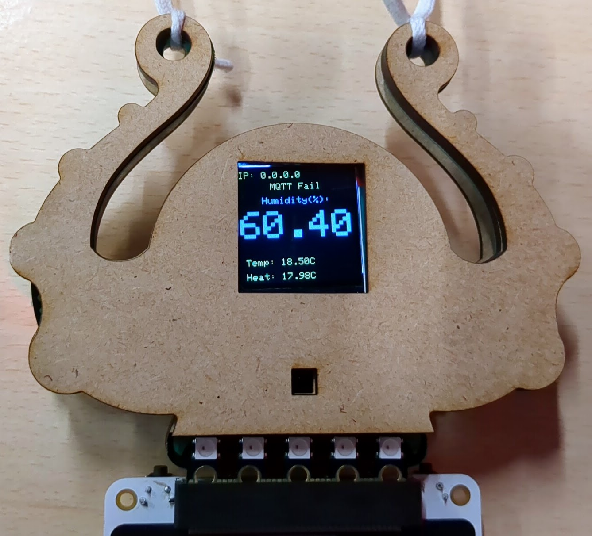
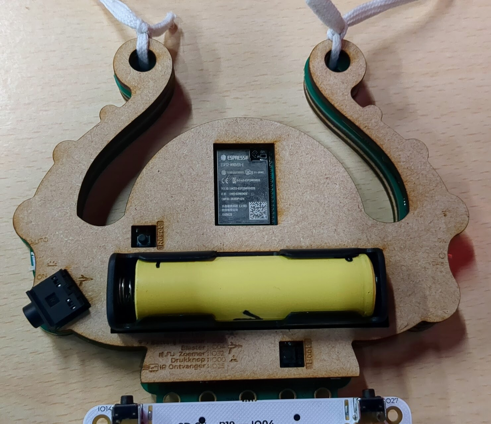

# Lasercut Fri3d Badge 2020 case files
Here in the directory lasercut files for K40 Whisperer software.

## Lasercut SVG Files
Front Top | Front Mid  - with spacers for Back (only spacers 2 needed, 2 reserve)| Back
:-------------------------:|:-------------------------:|:-------------------------:
|   | 

## Pictures
Front |  Back
:-------------------------:|:-------------------------:
 |  

## Credits
- Created by @TryingThingsWorks
- Made possible by [design files](https://github.com/Fri3dCamp/badge-2020/blob/7e2ec1d9987333af4cedac1ac36ba3c9e4ce6911/design/Fri3D_2020_02/OUTPUT/Fri3D_2020_02.PDF) in the [Fri3d Badge 2020 Repo](https://github.com/Fri3dCamp/badge-2020)
